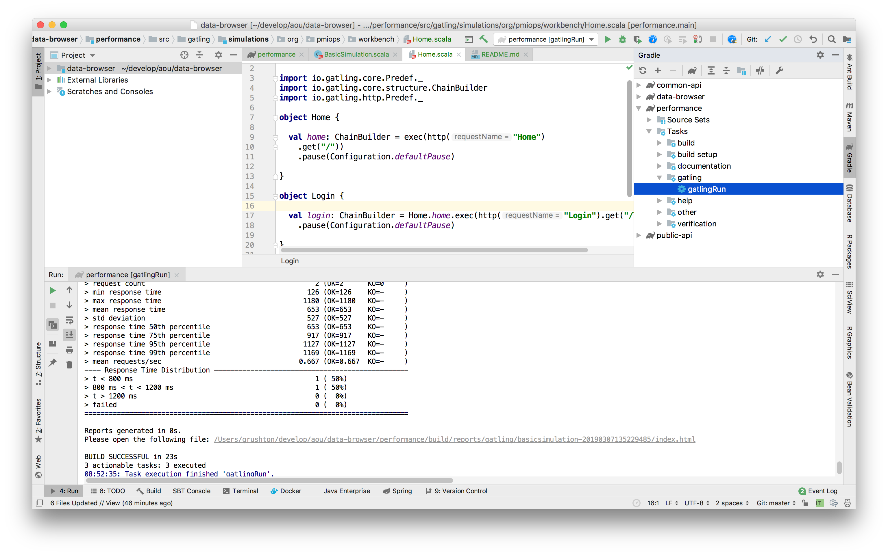

# Performance Testing with Gatling

* [Gatling Documentation](https://gatling.io/docs/current/)
* [Gradle Plugin Documentation](https://github.com/lkishalmi/gradle-gatling-plugin)

## Running Tests

From the `performance` directory, run the gatling tests (optionally accepts `-Denv=<ENV>` 
which defaults to the test environment):
```sbtshell
gradle gatlingRun
```

Tests can also be run from inside IntelliJ. Execute the `gatlingRun` 
gradle task (which uses the default `stable` environment ) as shown in 
this screenshot: 

Test runs are stored in `performance/build/reports/gatling/`

* TODO: Look into tabular results suitable for db storage
* TODO: Look into storing for historical comparisons


## Writing Tests

Tests are broken down into `Scenarios`. Each scenario is comprised of a series of `Pages`
Some pages require a previous 

https://gatling.io/docs/current/cheat-sheet/

* TODO: How to write a basic test
* TODO: How to configure failure criteria


## Configuring Tests

* TODO: How/where to generalize a config setting


## CircleCI Integration

* TODO: Add Circle job that does this
* TODO: How to execute circle job to run tests
 